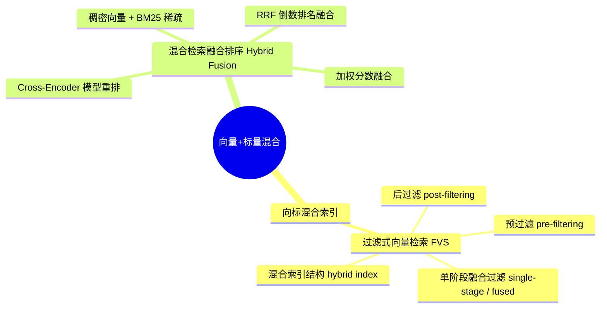
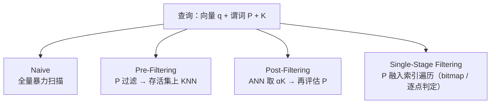
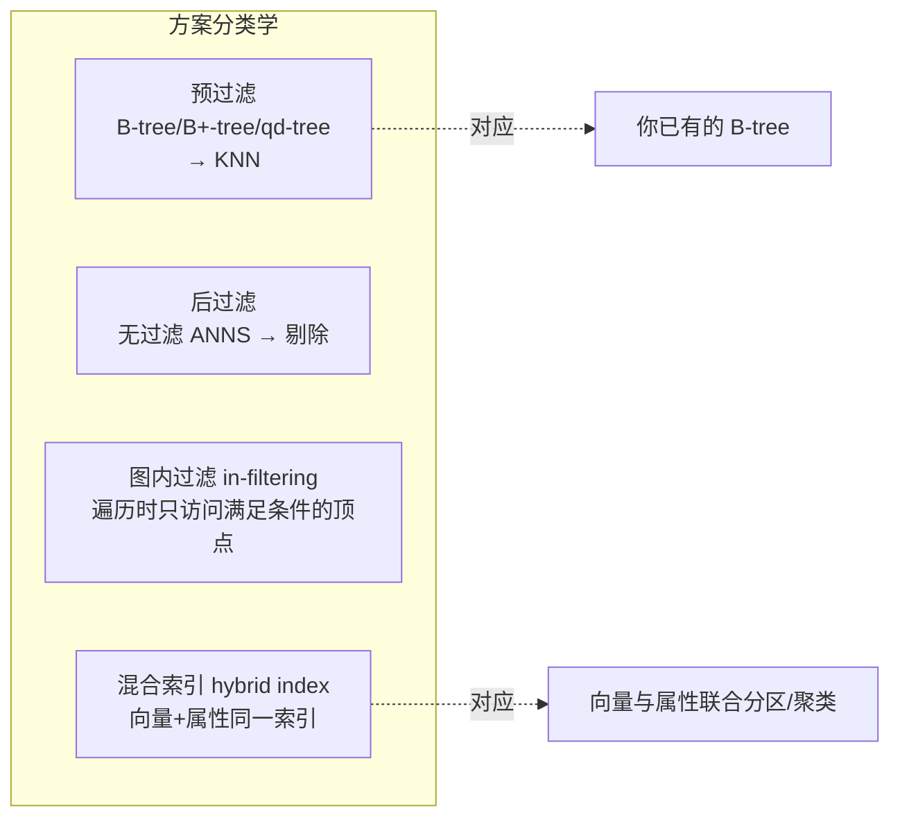
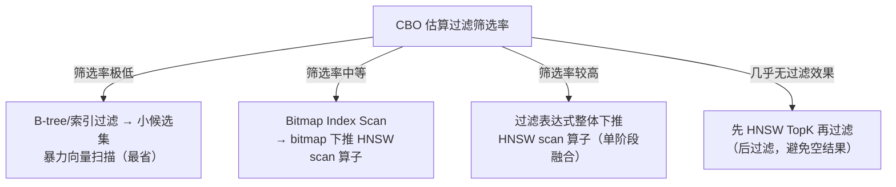
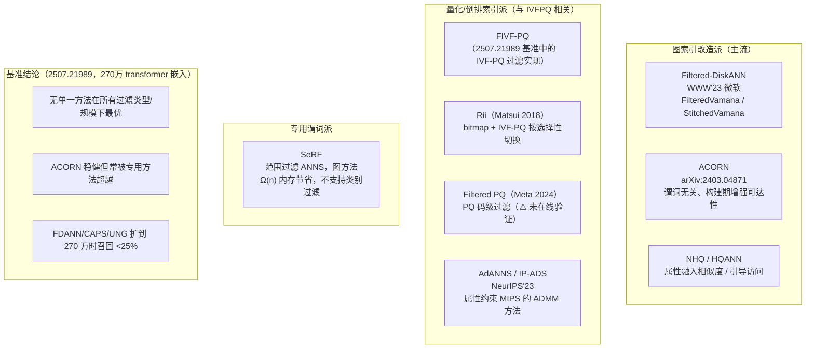
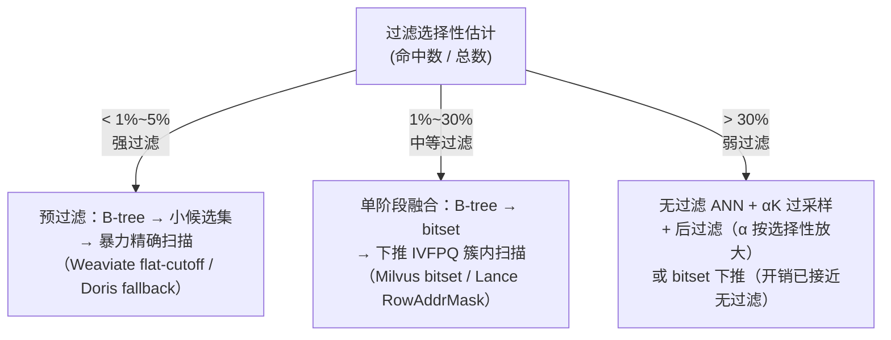
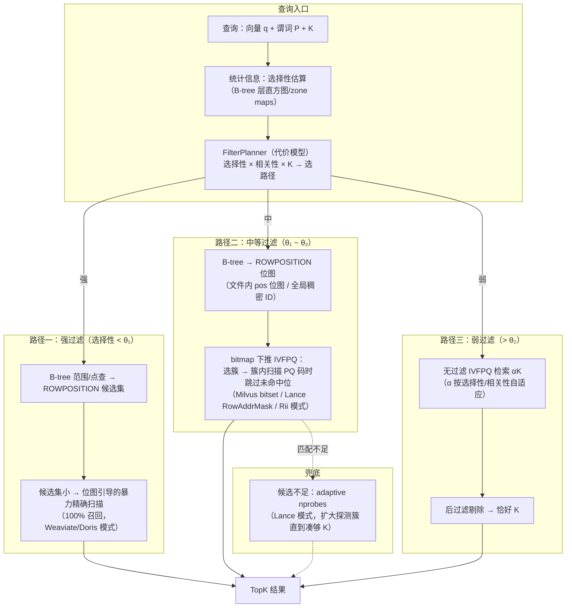
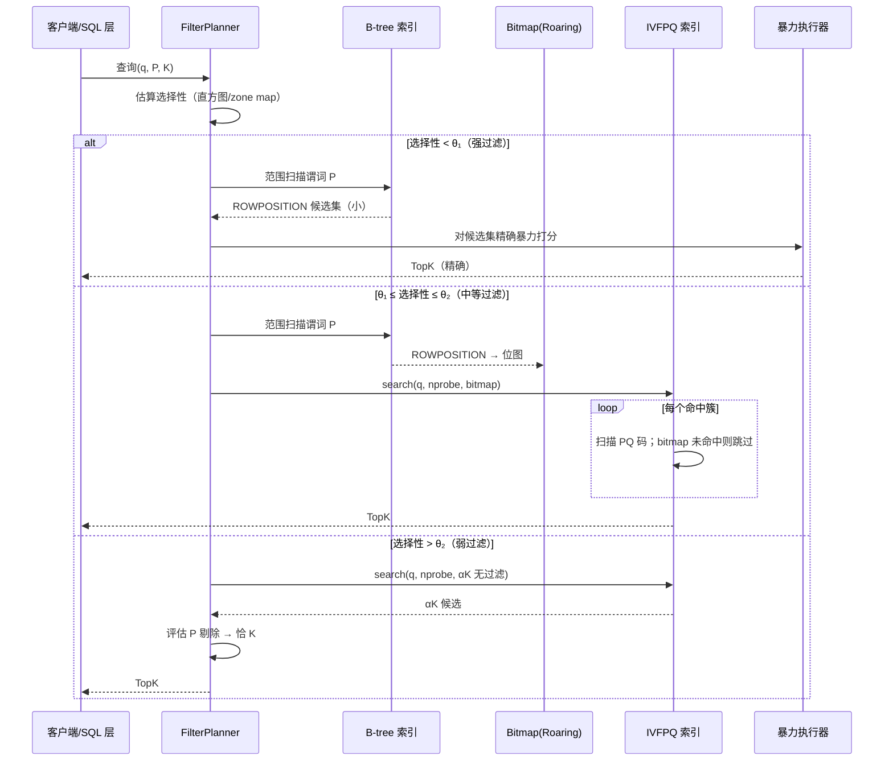

# 向量-标量混合索引（向标混合索引）技术调研报告

> 面向 `hybrid_index` 项目（已实现 **IVFPQ 向量索引** + **B-tree 标量索引**，Rust 实现、湖仓/Iceberg 场景）的向标混合索引方案选型与设计输入。
>
> 调研时间：2026-08-20

**术语口径**：文中「选择性（selectivity）」「筛选率」「选择率」同义，均指**满足过滤条件的行占比（命中占比 = 命中数/总数）**。方向约定：**低 = 强过滤**（存活集小），**高 = 弱过滤**（存活集大）。注意勿与"被过滤掉的行占比"混淆（方向相反）。

---

## 0. 调研方法与证据分级

本报告基于两阶段调研：

1. **多源对抗验证阶段**（后台工作流）：5 个搜索角度 → 26 个来源 → 提取 129 条事实声明 → 对 Top 25 条进行 3 票对抗式验证，最终 **8 条结论以 3:0 / 2:1 通过验证**；验证后期因 API 余额不足中断，其余声明仅保留单源证据。
2. **前台补充检索阶段**：针对商用落地案例（腾讯云、AnalyticDB）、湖仓方案（Databricks/Lance）、学术前沿（SeRF、AdANNS/IP-ADS）进行 6 次定向检索。

全文证据分级标注：

| 标记 | 含义 |
|---|---|
| ✅ | 经 3 票对抗式验证通过（Google/VLDB 2025 综述、清华 SIGMOD'24 教程、ETH arXiv 2507.21989 基准论文） |
| 📄 | 厂商官方文档/一手论文单源提取，未走对抗验证（可靠性高，但仅单源） |
| ⚠️ | 第三方博客/厂商宣传材料，需谨慎采信 |

---

## 1. 背景：什么是"向标混合索引"，为什么难

### 1.1 两个容易混淆的概念（重要澄清）

"向量+标量混合"在业界实际对应**两个不同层次**的技术，调研时需先区分：

1. **过滤式向量检索（Filtered Vector Search, FVS / Filtered ANN）**：查询 = 向量相似度 + 标量谓词（`category='electronics' AND price<100 AND vector~q`）。**索引层**问题——如何在标量谓词约束下高效、高召回地做近似最近邻检索。这是"向标混合索引"的本义，也是本报告的主体。
2. **混合检索融合排序（Hybrid Search / Hybrid Fusion）**：将稠密向量检索（语义）与稀疏全文检索（BM25 等关键词）**两路结果融合重排**（RRF、加权、模型重排）。**排序层**问题——通常发生在检索之后、甚至 SDK/应用层。

> 许多系统（Milvus、Weaviate、Doris、TiDB、LanceDB、ES）同时提供两者；本报告以 FVS 为主线，融合排序作为第 8 章补充，第 9 章给出结合两者的工程建议。

### 1.2 问题本质：为什么"加个 WHERE"会毁掉向量检索

三条已被验证的结论（✅，Google/VLDB 2025 综述 *Filtered Vector Search: State-of-the-art and Research Opportunities*，PVLDB 18(12):5488-5492，DOI 10.14778/3750601.3750700）：

- **为无过滤查询调优的执行方法，一旦加上过滤就无法维持高召回**。过滤改变了合格集合的规模与分布，并可能引入**过滤谓词与向量空间的相关性**：
  - **正相关**（如 `品牌=Apple` 时，附近向量大概率也满足过滤）→ 需要访问的向量更少，检索更容易；
  - **负相关**（过滤将向量空间"撕碎"）→ 需要访问的向量更多，检索更难。
- **后过滤天然需要过采样**：ANN 索引必须返回 αK（K 的倍数）个结果才能保证过滤后至少剩 K 个，这引入了一个额外调参项（α），且难以稳定达到高召回。
- 最优执行方法取决于 **选择性（selectivity，过滤命中占比）、过滤-向量相关性、K 值、数据分布** 四个因素——因此**不存在单一最优方案**，成熟系统都在做查询期自适应。

---

## 2. 方案分类学（Taxonomy）

### 2.1 三种执行方法（✅ 已验证，Google/VLDB 2025 综述）

| 方法 | 执行顺序 | 适用条件 |
|---|---|---|
| **预过滤 Pre-filtering** | 先用属性索引过滤，再对存活集做 KNN（存活集很小时可直接暴力） | 过滤结果集小（强过滤） |
| **后过滤 Post-filtering** | 先用向量索引做 ANN，再对结果集评估过滤谓词 | 弱过滤/无过滤场景 |
| **内联/单阶段融合过滤 Inline / Single-stage** | 搜索与过滤合一：过滤可先算成 **bitmap** 传入搜索，或在**索引遍历过程中逐点评估** | 中等过滤，需高召回 |

### 2.2 四种物理执行计划（✅ 已验证，清华 SIGMOD'24 教程 *Vector Database Management Techniques and Systems*，Pan/Wang/Li）

四种计划的定性对比（✅ 教程原文总结表）：

| 计划 | 召回 | 效率 | 风险 |
|---|---|---|---|
| Naive | 精确 100% | 数据量小或强过滤下可接受 | 数据量大时不可用 |
| Pre-Filtering | 精确 100% | 强过滤高效；**弱过滤延迟高**（几乎全量 KNN） | 弱过滤时退化为暴力 |
| Post-Filtering | **有召回损失风险**（交集可能为空） | 原生向量检索速度 + 原生过滤速度 | 空结果/召回不足，需 αK 过采样（ADBV 方案） |
| Single-Stage | **无召回损失**，常比预过滤更高效 | 图索引在强过滤下延迟高 | 图索引强过滤时遍历连通性差 |

### 2.3 第四类：混合索引结构（📄 ETH arXiv:2507.21989 基准论文的四分类）

ETH 的 2025 年 FANNS 基准论文（*Benchmarking Filtered Approximate Nearest Neighbor Search Algorithms on Transformer-based Embedding Vectors*，Iff et al.）将方案归为四类，其中明确给出与 B-tree 的直接对应关系（✅ 已验证原文）：

> "在预过滤中，**属性专用索引（如 B-tree、B+-tree 或 qd-tree）** 先选出所有满足过滤条件的项，再在其上执行 KNN……图内过滤（in-filtering）在建索引时忽略属性、遍历时只访问满足过滤的顶点；第四类为**混合索引（hybrid index）**：把嵌入向量与属性建在**同一个索引**里。"

### 2.4 商用系统如何枚举与选择计划（✅ 已验证，SIGMOD'24 教程）

- **单一固定计划**：Weaviate、Pinecone
- **预定义多计划 + 查询期选择**：ADBV、Milvus
- **优化器自动枚举计划**：PASE、pgvector（PostgreSQL）
- **规则式选择**：Qdrant、Vespa；**代价式选择**：ADBV、Milvus
- 教程明确警告："**后过滤的低召回风险是真实存在的**"，并引用了 pgvector issue #263 作为案例。

---

## 3. 商用/开源系统实现机制详析

### 3.1 专用向量数据库

#### Milvus / Zilliz（📄 官方文档）

- **机制**：布尔表达式 → 解析为 AST → 生成属性过滤物理计划 → **在每个 segment 执行生成 bitset** → bitset 作为**向量搜索参数**传入，缩小搜索范围（预过滤式融合）。
- **标量索引**（自 2.1.0 起）：自动索引（AUTOINDEX）+ 倒排索引 + Bitmap + Trie 等，官方明言"**向量搜索速度在很大程度上取决于属性过滤的速度**"。
- **分区过滤**：把最常过滤的属性做成 **Partition Key**，数据按分区切分、每分区单独建 ANN 索引——这是针对"强过滤撕裂向量空间"问题的**数据组织层解法**（对应教程中"通过分区减少失败"的 Milvus 路线）。
- **查询期自适应**：代价式在多个预定义计划中选择。
- 第三方基准（⚠️）：10% 选择性过滤下，Zilliz AUTOINDEX 的吞吐较暴力/后过滤回退引擎提升 1.2~1.5 倍。

#### Qdrant（📄 官方课程文档）

- **机制**：既非预过滤也非后过滤——**图内过滤（in-place）**：查询遍历 HNSW 图时对每个候选点**先检查过滤条件，不满足则跳过不评分**。
- **Filterable HNSW**：不是独立索引，而是 HNSW 图的**扩展**——按 payload 值为图**增加额外边**，并为每个 payload 值构造**连通子图**再合并回全图，保证过滤子集内遍历仍连通。
- **查询期自适应（按基数规则）**：高基数过滤 → 常规 HNSW 遍历 + 跳过不匹配点；**极低基数过滤 → 回退全表扫描**（此时图遍历反而不划算）。

#### Weaviate（📄 官方文档）

- **机制**：**预过滤**——用倒排索引生成 uint64 id 的 **allow-list** 传入 HNSW；遍历照常进行，但只把 allow-list 内的点加入结果。官方将"预过滤"与"单阶段过滤"视作等价（因为分片内倒排索引与 HNSW 并存，无需暴力扫描）。
- **Flat-search cutoff**：当"向量+标量"过滤命中率低于约 **15%** 时自动切换为**对命中子集的暴力扫描**（强过滤使 HNSW 遍历近乎全图，暴力反而更便宜）。
- **v1.34 起 ACORN 为默认过滤策略**：受 ACORN 论文启发的自研实现——跳过被过滤对象的距离计算、多跳邻域评估快速抵达相关图区域、注入额外满足过滤的入口点；在过滤与查询向量低相关时显著改善大规模数据性能。
- 官方文档同样指出后过滤两大缺陷：结果数不可预测（过滤作用于已缩小的候选集）、强过滤可能得到空结果。

#### Pinecone Serverless（📄 ICML 2025 VDB Workshop 论文）

- **机制**：把元数据过滤**直接集成进向量检索路径**（单阶段融合过滤），而非检索后丢弃；提出 "exact filter recall" 指标度量过滤精度。
- **架构**：对象存储中的**不可变向量 slab**（LSM-tree 结构）+ 无状态按需执行器 + 自定义协调机制（存储与计算解耦下保持正确性）。
- 教训：serverless 架构下做"精确过滤"是工程难点，需要专门的存储布局配合。

#### Vespa（📄 官方 Hybrid Search Lab）

- **机制**：两阶段 rank profile：第一阶段 `bm25_score + closeness(field, q)` **线性组合**打分；全局阶段对 Top 100 候选做 **RRF 融合**。同时提供 WAND 与弱 AND 等预过滤算子族。

#### FAISS（⚠️ 通用工程常识，未逐条验证）

- `IDSelectorBitmap` / `IDSelectorArray`：过滤表达为 id 位图，`IndexIVFPQ::search(..., params, selector)` 时**只扫描位图命中的条目**——IVF 系索引的标准单阶段融合过滤做法，也是 Milvus/Rii/Lance 等系统位图下推方案的共同源头。

### 3.2 SQL / 分析型数据库内嵌

#### 阿里云 AnalyticDB MySQL（⚠️ 厂商技术文章）

- **CBO 驱动的四路径自适应**（按结构化过滤筛选率＝选择性＝命中占比选择，最值得借鉴的工程样本）：

- 商用数据（⚠️ 厂商口径）：某头部 AI 内容平台（日均 500 万条内容）用一套 AnalyticDB 替代 ClickHouse+Milvus+ES 三库，运维成本降约 70%；1 亿条 768 维向量 + 5 亿结构化数据的基准中向量检索 P99 42ms。

#### Apache Doris（📄 官方文档）

- 单表 SQL 内同时建**倒排索引（BM25/MATCH_ANY）+ ANN 索引（HNSW/IVF/IVF-on-disk）**，filtered ANN **默认预过滤**（标量/全文谓词先过滤，ANN TopN 只在存活行上执行）；**选择性过强时自动回退**到对过滤后集合的暴力向量打分（adaptive fallback）。无需客户端 join 或外部融合服务——SQL 一体化混合索引的直接参考。

#### TiDB（📄 官方文档）

- 混合搜索是**两阶段工作流**：全文（BM25）搜索与向量搜索分别执行，再由 **reranker 在 SDK 层**（pytidb）融合——`rrf`（默认）/ `weighted` 两种方法。即：过滤检索留在引擎内，融合排序放在 SDK 层。

#### pgvector（📄 issue #575、#263）

- 截至 0.7.0（2024-05），HNSW 索引扫描 + WHERE 是**后过滤**：图遍历先返回距离序 tuple，过滤谓词作用于**输出流**，并未下推进遍历。这导致教程中点名的"后过滤低召回风险"（#263），社区正在迭代过滤感知的索引扫描。

### 3.3 搜索引擎

#### Elasticsearch / OpenSearch（📄 官方文档 + Search Labs）

- **过滤语义**：filter **在近似 kNN 搜索过程中应用**（预过滤语义），保证恰好返回 K 个匹配文档；官方明言这与后过滤（可能返回少于 K 个甚至空结果）相对照。
- **9.1 起引入 ACORN-1**（Lucene 层）：把过滤**直接集成进 HNSW 图遍历**（而非独立的过滤图索引）。
- **混合检索**：BM25 + kNN 双查询 + **RRF** 融合：`score = Σ_q 1/(k + rank(q))`。

### 3.4 湖仓原生（与本项目最相关）

#### Lance / LanceDB（📄 官方文档 + DeepWiki 源码级分析）

- **预过滤实现**：标量索引结果转为 **RowAddrMask（行地址位图）+ PreFilter 对象**，传入向量索引搜索——**过滤在 IVF 分区搜索内部生效**，而非 ANN 返回后再过滤。
- `DatasetPreFilter` = **删除掩码 AND SQL 过滤掩码**，异步加载；**adaptive nprobes**：初始 probe 数不足 K 个匹配时自动增加 IVF 探测分区数（`maximum_nprobes` 封顶）——这正是 IVF 系过滤检索的关键补丁。
- 官方选型指引：**强过滤且要求恰好 K 个结果 → 预过滤**；宽过滤重性能 → 后过滤（默认）。
- **混合检索**：向量 + 全文两路子查询 + reranker 融合：`RRFReranker`（默认，按 rank 融合，免模型）、`LinearCombinationReranker`（score 归一化加权，默认偏向向量 0.7）、`MRRReranker`（加权 RRF）；实测 hit-rate@k 从 0.64 提升至 0.85。

#### Databricks Mosaic AI Vector Search（📄 官方文档）

- 在 Delta 表上 `CREATE VECTOR INDEX`（EMBEDDING/TEXT/METADATA 列），SQL `VECTOR_SEARCH()` + 过滤表达式（`=`、`!=`、`<`、`<=`、`>`、`>=`、`AND`/`OR`/`NOT`、`LIKE`、`IN`）。
- **Storage-optimized 端点有"过取"行为**：取多于 k 的行再过滤——官方文档明言"**即使存在匹配行也可能返回空结果**"（后过滤语义）。说明湖仓托管向量检索同样没绕开这一坑。

#### 湖仓文件级预过滤（📄 DeepWiki Lance 源码分析提取）

- Lance 体系的工程实践：**IVF 索引内嵌于每个 Parquet 文件 footer**，复用湖仓引擎已有的**文件剪枝栈**（分区剪枝、zone maps、bitmap 索引）先按谓词剪枝数据文件，再对存活文件执行 per-file ANN——即**文件粒度的预过滤**，无需为过滤引入全新索引。这对 Iceberg 场景可直接类比：manifest 层分区/列统计剪枝天然是第一级过滤器。

### 3.5 商用系统总览表

| 系统 | 过滤机制 | 查询期自适应 | 标量索引 | 混合融合 |
|---|---|---|---|---|
| Milvus | bitset 预过滤（单阶段） | ✅ 代价式多计划 | 倒排/Bitmap/Trie/自动 | RRF/加权 |
| Qdrant | 图内过滤 + payload 边 | ✅ 基数规则（低基数回退全扫） | payload 索引 | 支持 |
| Weaviate | 倒排 allow-list 预过滤 + 15% flat cutoff | 阈值切换 | 倒排 | Alpha 加权 |
| Pinecone SLS | 检索路径内融合过滤 | 内置 | — | — |
| Vespa | WAND 预过滤族 + 两阶段 rank | 规则式 | 属性索引 | RRF/加权 |
| FAISS | IDSelector 位图（IVF 内过滤） | 手动 | 外部 | — |
| AnalyticDB | **CBO 四路径**（暴力/位图下推/谓词下推/后过滤） | ✅ 代价式 | B-tree/Bitmap | BM25 原生 |
| Doris | 预过滤默认 + 强过滤暴力回退 | 阈值回退 | 倒排 | 单表 SQL 融合 |
| TiDB | 引擎内过滤 + SDK 层融合 | — | 二级索引 | RRF/weighted（SDK） |
| pgvector | 后过滤（0.7.0） | 优化器枚举 | B-tree | — |
| Elasticsearch | kNN 期间过滤 + ACORN-1（9.1+） | — | 倒排/doc values | RRF |
| LanceDB | RowAddrMask 预过滤 + adaptive nprobes | nprobes 自适应 | B-tree/倒排/zone map | RRF/Linear/MRRF |
| Databricks VS | 托管过滤（storage-opt 端点过取=后过滤语义） | — | Delta 列统计 | 支持 |

---

## 4. 学术前沿方案

### 4.1 谱系总览

### 4.2 逐项要点

- **Filtered-DiskANN**（📄 WWW 2023，微软）：两种原生过滤图算法——**FilteredVamana**（流式增量插入 + RobustPrune）与 **StitchedVamana**（按 label 分图构建后缝合）；在带自然标签的真实数据上，过滤查询效率比基线**高一个数量级以上**。
- **ACORN**（📄 arXiv:2403.04871）：构建在 HNSW 之上、**谓词无关**；在 HNSW 构建期加入基于属性的额外边以**保证过滤后的可达性**（1-level 扩展）。已获两大商用落地：**Elasticsearch 9.1（Lucene 层 ACORN-1）** 与 **Weaviate 1.34（默认过滤策略）**——学术方案向生产转化的最有力证据。
- **SeRF**（⚠️ 2024，范围过滤 ANNS）：每条向量绑定属性值（时间戳/价格等），查询为属性**范围**约束下的近邻检索；图方法，内存占用较朴素方案有 Ω(n) 量级节省；**不支持类别型过滤**。
- **AdANNS / IP-ADS**（📄 NeurIPS 2023，arXiv:2305.19435）：AdANNS 框架统一了自适应检索；其中 IP-ADS 针对**带属性硬约束的 MIPS**，用 ADMM 类优化把过滤约束纳入检索过程，解决"过滤下内积检索退化"问题。
- **FIVF-PQ / Rii**（📄 2507.21989）：IVF-PQ 的过滤实践——**bitmap 表示匹配项**；选择性低时对连续存储的 PQ 码直接暴力比较，选择性高时先做 IVF 簇选择、仅在簇内比较满足过滤的 PQ 码（融合过滤）——**按选择性在预过滤与融合过滤间自适应切换**，与你的 IVFPQ 场景直接对应。
- **Filtered Product Quantization**（⚠️ Meta 2024 技术报告，本次调研未能在线验证出处）：针对过滤式 MIPS 的 PQ 级过滤（bitvector 预过滤思想）。**建议自行核实**，但方向（把过滤位图推进到 PQ 子量化器扫描层）与 FIVF-PQ/Rii 一致。
- 另有一条被验证否决的结论值得注意：Google/VLDB 2025 综述指出**已发表的"过滤优化索引结构改造"几乎全部针对图索引**，IVF/倒排系缺乏对应的已发表方案——对你的项目既是约束也是**差异化机会**。

---

## 5. 方案优劣对比

| 维度 | 预过滤 | 后过滤 | 单阶段融合（bitmap 下推） | 图内过滤（HNSW 系） | 混合索引结构 |
|---|---|---|---|---|---|
| 召回保证 | ✅ 精确 100% | ❌ 可能空结果/召回塌方 | ✅ 无召回损失 | ✅ 无召回损失 | ✅ 好（若设计得当） |
| 强过滤（选择性低） | ✅ 高效 | ❌ 大量浪费 | ✅ 高效（候选集小时可暴力） | ❌ 图被撕裂、遍历退化 | ✅ 好 |
| 弱过滤（选择性高） | ❌ 近似全量扫描 | ✅ 原生速度 | ✅ 与无过滤接近 | ✅ 好 | ✅ 好 |
| 与 IVFPQ 契合度 | ✅ B-tree 直接复用 | ✅ 无需改造 | ✅ **天然契合**（簇内扫描+位图） | ➖ 图索引专属 | ➖ 需重建索引 |
| 实现复杂度 | 低 | 低（但需 αK 调参） | 中 | 高（需改图构建） | 高 |
| 附加内存 | B-tree | 无 | bitmap | 图边（可达性扩展） | 高 |
| 代表性落地 | Doris/Weaviate/LanceDB | pgvector/TiDB 部分 | Milvus/FAISS/Lance/ADB | Qdrant/ES 9.1/Weaviate 1.34 | 学术为主 |

**核心结论**（✅ 三重验证收敛）：**不存在全局最优方案；最优选择由过滤选择性、过滤-向量相关性、K、数据分布共同决定**。这正是所有成熟商用系统（AnalyticDB 四路径 CBO、Milvus 代价式、Qdrant 基数规则、Weaviate 15% 阈值、LanceDB adaptive nprobes）都在做**查询期自适应**的原因。

---

## 6. 适用场景分析

### 6.1 按过滤选择性（核心决策轴）

### 6.2 场景 × 方案矩阵

| 场景 | 典型过滤形态 | 推荐方案 | 反例 |
|---|---|---|---|
| 电商商品检索（品类+价格+向量） | 强~中等过滤，属性低基数 | 预过滤 + 单阶段融合 | 后过滤会空结果 |
| 多租户知识库 RAG（tenant_id + 向量） | 极强过滤（按租户） | 分区键（Milvus partition key）+ 分区内暴力/小索引 | 全局图索引被租户过滤撕裂 |
| 推荐系统（用户画像过滤 + 向量） | 中等，属性多、组合复杂 | bitmap 下推 IVF（AnalyticDB 路径 2/3） | 纯预过滤候选集过大 |
| 日志/时序检索（时间范围 + 向量） | 范围过滤 | SeRF 类范围过滤索引 / B-tree 范围 + 融合 | 通用类别过滤方案 |
| 全文+语义混合（BM25 + 稠密） | 无硬过滤，双路召回 | 双索引 + RRF/加权融合（Doris/TiDB/LanceDB/ES 模式） | 单一稠密索引 |
| 湖仓大规模离线检索（亿级） | 文件级剪枝 + 文件内过滤 | 分区/zone map 剪枝 → per-file IVF + RowAddrMask（Lance 模式） | 全量内存图索引 |
| OLTP 低延迟点查式（pgvector 类） | 弱过滤 | 后过滤（当前）+ 演进到过滤感知扫描 | 期待强过滤高召回 |

---

## 7. 商用落地案例

| 案例 | 系统 | 形态 | 证据等级 |
|---|---|---|---|
| 腾讯内部 60+ 业务（OLAMA 引擎，2019 上线，日均超 8500 亿次检索，单索引千亿级） | 腾讯云向量数据库 | 混合检索（稠密+稀疏双路）+ RRF/加权/模型重排；Flat/HNSW/IVF/DiskANN；DiskFLAT 100% 召回、成本降 90% | ⚠️ 厂商宣传 |
| 腾讯云对外案例：RAG 智能客服、拍照搜题（替代自建 Milvus，模型更新无感切换）、内容推荐 | 腾讯云向量数据库 | 混合检索 | ⚠️ 厂商宣传 |
| 头部 AI 内容平台（日均 500 万条内容）：一套 AnalyticDB 替代 ClickHouse+Milvus+ES 三库，运维成本约降 70%，P99 42ms | 阿里云 AnalyticDB MySQL | CBO 四路径过滤 + 单表 SQL 一体化 | ⚠️ 厂商宣传 |
| Elasticsearch 9.1 发布 ACORN-1 过滤 kNN（Lucene 层） | Elastic | 图内过滤（学术→商用） | 📄 官方 |
| Weaviate 1.34 起 ACORN 过滤策略为默认 | Weaviate | 图内过滤（学术→商用） | 📄 官方 |
| Databricks Mosaic AI Vector Search：Delta 表上过滤式向量检索 GA | Databricks | 湖仓托管过滤检索 | 📄 官方 |
| pgvector 生态（Supabase 等）：过滤检索问题在 issue #263/#575 被社区确认为后过滤召回缺陷 | pgvector | 反面案例 | 📄 issue |

**落地形态观察**：商用系统普遍选择"**标量索引（B-tree/倒排/Bitmap）→ 位图/allow-list → 向量索引融合**"的工程路线（Milvus、Weaviate、AnalyticDB、LanceDB、Doris），而不是重建"向量+属性一体索引"——因为前者可增量演进、复用成熟组件；图内过滤（ACORN 系）正在成为图索引阵营的新默认。

---

## 8. 混合检索融合排序补充（Hybrid Fusion）

过滤式检索与融合排序可叠加（如 Doris 单表 SQL：先过滤，再 BM25+向量融合 TopN）。三种主流融合算法：

| 算法 | 原理 | 适用 |
|---|---|---|
| **RRF 倒数排名融合** | `score = Σ_q 1/(k + rank_q)`，只依赖排名，天然免归一化（ES/LanceDB 默认/TiDB 默认/Vespa 全局阶段） | 分数不可比的异质检索（BM25 vs 余弦） |
| **加权分数融合** | 各自归一化（score/rank 两种归一化路径）后线性加权（LanceDB 默认偏向向量 0.7；Weaviate alpha 同思路） | 分数分布可控、可调权重的场景 |
| **模型重排** | Cross-Encoder 等对融合候选精排 | 追求质量上限、候选集小的场景 |

实测参考（📄 LanceDB 官方）：加 reranker 后 hit-rate@k 从 0.64 提升至 0.85。

---

## 9. 对当前项目（IVFPQ + B-tree）的设计建议

### 9.1 现状盘点与关键洞察

你的组件恰好对应学术界最标准的组合：**B-tree 是预过滤定义中的"属性专用索引"**（✅ 已由 arXiv 2507.21989 原文验证），而 **IVFPQ 的簇内线性扫描结构天然适合位图融合过滤**（簇内逐条比较 PQ 码时顺手检查位图，零结构改造）。三个关键洞察：

1. **学术界的过滤优化改造几乎都发生在图索引上**；IVF 系已发表的方案仅有 FIVF-PQ、Rii 等少数——在 IVF 系过滤上做深是**低竞争赛道**，且有 Rii/FIVF-PQ/Milvus 的工程先例可循。
2. **湖仓场景自带第一级过滤器**：Iceberg manifest 的分区/列统计剪枝 = 文件级预过滤（对应 Lance 的"Parquet footer IVF + 文件剪枝栈"实践），不要在建索引层重复造。
3. 商用系统的共识是**查询期自适应**而非单一策略：选择性 + 相关性 + K 共同决定最优路径。

### 9.2 推荐架构：分层过滤 + 自适应 Planner

### 9.2.1 ROWPOSITION 下的位图表示（无 RowID 适配）

当前系统使用 **ROWPOSITION（`(file_path, pos)` 复合键）** 而非全局 RowID。三路径架构不变，位图层有两种落地方式：

| 方案 | 结构 | 适用条件 | 取舍 |
|---|---|---|---|
| **文件内 pos 位图**（湖仓推荐） | 两级 Roaring：file_id → 文件内 pos bitset | IVFPQ 按文件组织（per-file IVF，Lance footer 模式） | 热循环两级查表；但与 **Iceberg position deletes 同键空间**，删除掩码与过滤掩码可直接 AND（Lance `DatasetPreFilter` 同款），并天然配合 manifest 文件级剪枝 |
| **索引内稠密 offset** | 全局 0..N-1 稠密 ID + offset↔ROWPOSITION 映射表（随索引元数据持久化） | IVFPQ 跨文件全局单索引空间 | 热循环单层位图最快；代价是 compaction 改 pos 后需重映射，结果物化多一次翻译 |

扫描层逻辑不变：簇内逐 PQ 码比较时查位图、未命中即跳过，两种表示只是位图键的差异。

### 9.2.2 备选形态：B-tree 与 IVFPQ 并行查询 + 交集合并

该模式 = B-tree 全量谓词匹配集 M ∥ IVFPQ 无过滤 top-αK → 交集 TopK，即后过滤计划族（SIGMOD'24 教程 "Post-Filtering：native vector search speed & native attribute filter speed"，ADBV αK 模式）的并行实现形态。

- **价值**：IVFPQ 内核零改造即可落地；选择性决策后置——合并时观察 |M|，小则弃 V 转暴力精确扫描（等效预过滤、100% 召回），大则求交（等效后过滤）；延迟 ≈ max(两路) + 位图 AND；匹配集 M 可跨查询复用。
- **告诫**：召回上限仍由向量分支的 αK 窗口决定（标量侧精确救不了向量侧），α 需按 ~1/σ 放大；中等过滤下总付全量无过滤 ANN 扫描代价，不如 bitmap 下推融合（簇级剪枝 + adaptive nprobes）。
- **定位**：作为 P0 起步路径（弱/强过滤两极端），随后用统计信息把强过滤直接派发到 B-tree 分支，中等过滤升级到融合下推。
- **合并算子**：与过滤位图同键空间（ROWPOSITION 位图 AND，见 9.2.1）。

### 9.3 进阶优化（分阶段）

**P1 —— 最小可用（对标 Weaviate/Doris 的工程下限）**
- B-tree 谓词扫描 → ROWPOSITION 位图；选择性 < θ 时按位图对候选集做文件内跳过式暴力精确扫描（含 PQ 残差精排）；位图与 position deletes 掩码同键空间，可合并复用。
- 收益：强过滤场景召回 100%、延迟最优；实现量最小。

**P2 —— bitmap 下推 IVFPQ（对标 Milvus/Lance/Rii 主路径）**
- IVF 簇选择后，簇内逐 PQ 码比较时检查位图，跳过未命中条目；增加 `adaptive nprobes`（匹配数不足 K 时扩大探测簇）。
- 收益：中等过滤下召回无损且扫描量近最优；实现点集中在 `search` 内层循环，对现有 IVFPQ 改动小。

**P3 —— PQ 码级过滤（对标 Meta FPQ 方向 / FIVF-PQ）**
- 为每个 PQ 码块附**过滤位向量**（或按簇内顺序码段存 bitmap 段），使簇内扫描可以对整段未命中块**提前跳过**，把过滤判断从逐条推进到逐块；可选地把高频过滤属性纳入**簇分配维度**（向"混合索引结构"演进：按属性分层聚类，使簇内相关性为正——对应 Google 综述的"正相关减少搜索代价"结论）。
- 收益：把位图判断成本摊薄一个数量级；为学术差异化作铺垫。

**P4 —— 查询期自适应 Planner + 融合排序**
- 采集 B-tree 层统计（等宽直方图 + 分区统计）做选择性估计，实现 θ₁/θ₂ 阈值切换与 αK 自适应（AnalyticDB 四路径的简化版）；
- 可选叠加：BM25 稀疏路 + RRF 融合（Doris/TiDB/LanceDB 模式），覆盖纯语义检索场景。

**湖仓集成建议**：IVF 索引元数据落 Parquet footer（Lance 模式），复用 Iceberg manifest 分区/列统计剪枝作为第零级过滤；B-tree 与 bitmap 按文件粒度组织，使文件级剪枝与文件内过滤共享同一 bitmap 管线。

### 9.4 风险与边界

- 后过滤路径务必保留 αK 放大参数并做召回监控（pgvector #263 的前车之鉴）；
- 过滤-向量**负相关**是召回杀手：建议在 P3 引入属性分层聚类前，先用 `q 与过滤属性分布的相关性` 做在线探测，负相关明显时强制走 bitmap 下推而非无过滤+后过滤；
- 阈值 θ₁/θ₂ 需按自有数据做离线 benchmark 标定（参考 2507.21989 的结论：**无万能阈值，随数据集与过滤类型变化**）。

---

## 10. 总结

1. **向标混合索引没有单一最优解**：预过滤、后过滤、单阶段融合过滤、图内过滤、混合索引结构各有优劣，最优策略由**过滤选择性、过滤-向量相关性、K、数据分布**共同决定（✅ 三重来源验证）。
2. **商用系统共识**：以"标量索引 → 位图/allow-list → 向量索引融合"的**单阶段融合过滤**为主路径，全部配**查询期自适应**（AnalyticDB 四路径 CBO 是最成熟的工程样本）；图索引阵营正转向 ACORN 式图内过滤（ES 9.1、Weaviate 1.34 已商用）。
3. **湖仓场景有天然优势**：文件级剪枝（分区/zone map/manifest）是免费的第零级过滤；Lance 的 RowAddrMask + adaptive nprobes 是与 Iceberg 最贴近的工程先例。
4. **对本项目**：B-tree（预过滤）+ IVFPQ（bitmap 下推融合）+ 暴力回退的三路径架构是最短落地路线；IVF 系过滤优化在学术界尚属蓝海，PQ 码级过滤与属性分层聚类是差异化方向。

---

## 参考文献

**✅ 经对抗验证的一手来源：**

1. Caminal, Chronis, Papakonstantinou, Özcan, Ailamaki. *Filtered Vector Search: State-of-the-art and Research Opportunities*. PVLDB 18(12):5488-5492, VLDB 2025. DOI 10.14778/3750601.3750700 — https://research.google/pubs/filtered-vector-search-state-of-the-art-and-research-opportunities/
2. Pan, Wang, Li. *Vector Database Management Techniques and Systems*. SIGMOD 2024 Tutorial — https://dbgroup.cs.tsinghua.edu.cn/ligl/papers/vdbms-tutorial2024.pdf
3. Iff, Brügger, Chrapek, Besta, Hoefler (ETH). *Benchmarking Filtered Approximate Nearest Neighbor Search Algorithms on Transformer-based Embedding Vectors*. arXiv:2507.21989 — https://arxiv.org/abs/2507.21989

**📄 系统官方文档与论文：**

4. Milvus 标量索引文档 — https://milvus.io/docs/zh/scalar_index.md
5. Qdrant Filterable HNSW 课程 — https://qdrant.tech/course/essentials/day-2/filterable-hnsw/ ；pre/post filtering 博客 — https://qdrant.tech/blog/pre-filtering-vs-post-filtering/
6. Weaviate Pre-filtering 概念文档 — https://weaviate.io/developers/weaviate/concepts/prefiltering
7. Pinecone Serverless Metadata Filtering（ICML 2025 VDB Workshop） — https://www.pinecone.io/research/accurate-and-efficient-metadata-filtering-in-pinecones-serverless-vector-database/
8. Elasticsearch kNN — https://www.elastic.co/guide/en/elasticsearch/reference/8.12/knn-search.html ；RRF — https://www.elastic.co/guide/en/elasticsearch/reference/current/rrf.html ；9.1 ACORN — https://www.elastic.co/search-labs/blog/elasticsearch-9-1-bbq-acorn-vector-search
9. pgvector issues — https://github.com/pgvector/pgvector/issues/575 、#263
10. Vespa Hybrid Search Lab — https://learn.vespa.ai/vector-search/lab-hybrid/
11. Apache Doris Hybrid Search — https://doris.apache.org/docs/dev/key-features/hybrid-search
12. TiDB 向量混合搜索 — https://docs.pingcap.com/zh/ai/vector-search-hybrid-search/
13. LanceDB Reranking — https://docs.lancedb.com/reranking ；Hybrid Search — https://docs.lancedb.com/hybrid/hybrid_search/ ；SQL 过滤 — https://lancedb.github.io/lancedb/sql/
14. Lance 索引系统 / 向量检索源码分析 — https://deepwiki.com/lancedb/lance/4.1-index-system-overview 、https://deepwiki.com/lancedb/lance/5.2-vector-search
15. Databricks Vector Search 查询文档 — https://learn.microsoft.com/azure/databricks/vector-search/query-vector-search

**📄 学术论文：**

16. Gollapudi et al. *Filtered-DiskANN*（WWW 2023） — https://dl.acm.org/doi/10.1145/3543507.3583552
17. Patel et al. *ACORN: Performant and Predicate-Agnostic Search Over Vector Embeddings and Structured Data*. arXiv:2403.04871 — https://arxiv.org/abs/2403.04871
18. Rege et al. *AdANNS: A Framework for Adaptive Semantic Search*（NeurIPS 2023）. arXiv:2305.19435 — https://github.com/RAIVNLab/AdANNS
19. 统一 FANNS 分类法（pre/post/joint-filtering 两轴分类，SIGMOD 2026） — https://arxiv.org/abs/2508.16263
20. *SQUASH*（serverless 混合向量检索，OSQ 对属性过滤更友好）. arXiv:2502.01528 — https://arxiv.org/abs/2502.01528
21. SeRF（范围过滤 ANNS）介绍 — https://part4project.foe.auckland.ac.nz/home/project/detail/5790/

**⚠️ 第三方评测与厂商案例：**

22. 六引擎过滤检索基准（Faiss/Qdrant/Pinecone/Weaviate/Zilliz/LanceDB/OpenSearch/PGVector） — https://yudhiesh.github.io/2025/05/09/the-achilles-heel-of-vector-search-filters/
23. 腾讯云向量数据库（OLAMA、混合检索、案例） — https://cloud.tencent.cn/developer/article/2677163 、https://cloud.tencent.cn/developer/article/2677162 、https://cloud.tencent.cn/developer/article/2330274
24. AnalyticDB MySQL 向量+SQL 一体化选型与案例 — https://segmentfault.com/a/1190000048066002
25. 预/后/图内过滤方案指南 — https://mixpeek.com/guides/filtered-vector-search-pre-post-in-place
